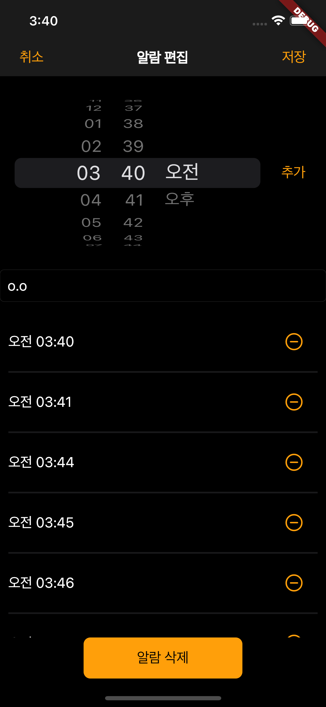

# 그룹 알람 애플리케이션 with </a>

### 프로젝트 설명
> 그룹 알람 애플리케이션 '하아암'은 알람을 못 들을까 걱정하여 
> 다수의 알람을 설정하는 이들에게 
> 다수의 알람을 하나의 그룹으로 묶어 
> 더 직관적으로 관리할 수 있도록 하는 애플리케이션입니다.

### 실행 조건 
> 해당 프로젝트는 네이티브 앱 프레임워크 Flutter를 이용하여 개발되었으며, 이에 따라 실행을 위해 Flutter SDK와 애뮬레이터 설치가 필요합니다. 
> 이는 [Flutter 공식 문서](https://flutter-ko.dev/docs/get-started/install)를 참고하여 설치할 수 있습니다.

### 실행 방법
> 애뮬레이터를 실행하고 `flutter run` 명령어를 실행하여 애플리케이션을 실행할 수 있습니다.

### 실행 화면

  
  <h3>알람 목록</h3>
  
  <h3>알람 추가</h3>
  
  <h3>알람 편집</h3>
    
  <h3>실행 과정</h3>

### 프로젝트 후기 
> https://talking-potato.me/61
